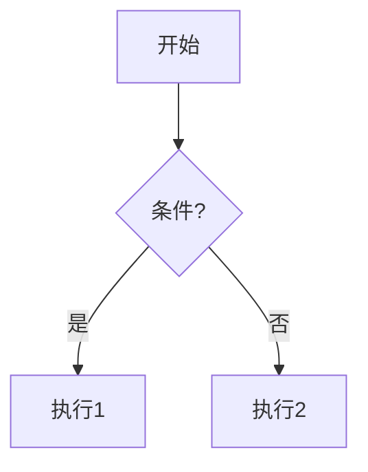
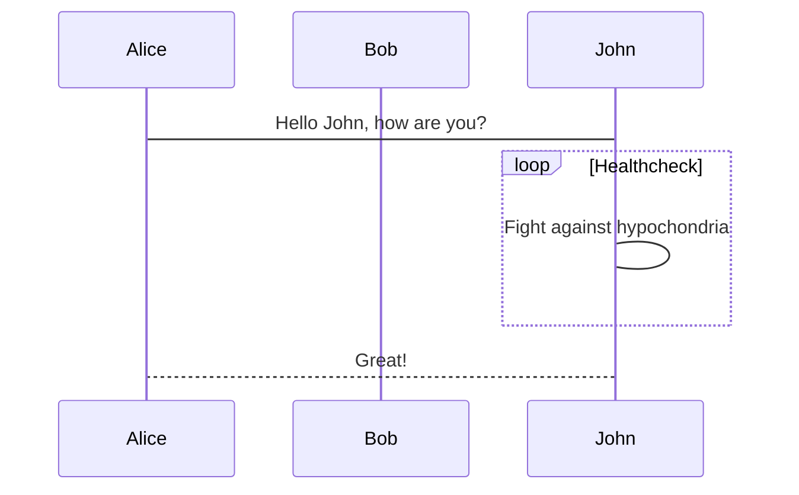

# vue3-markdown-lite

[](https://badge.fury.io/js/vue3-markdown-lite)
[](https://opensource.org/licenses/MIT)


一款轻量级的 Vue3 Markdown 渲染组件，专注于为 Vue3 项目提供简单、高效的 Markdown 解析与展示能力，支持丰富的语法特性和交互功能。

## 特性

- **简洁易用**：开箱即用，通过简单配置即可快速集成到 Vue3 项目中
- **全面语法支持**：
    - 基础语法：标题、文本格式（粗体/斜体/删除线）、列表（有序/无序/任务列表）、链接、图片、引用块、表格、分割线等
    - 高级功能：代码高亮（支持多语言）、数学公式（KaTeX）、图表渲染（Mermaid 流程图/序列图/甘特图、ECharts）
    - 扩展语法：提示块（info/success/warning/error）、内容对齐、带标题图片、打字效果（基于 Typed.js）、折叠块等
- **实用交互**：代码块复制、折叠/展开、图片预览缩放、暗黑模式适配
- **功能扩展**：支持 PDF 导出、双向绑定（v-model）
- **响应式设计**：适配桌面端与移动端展示
- **类型安全**：基于 TypeScript 开发，提供完整类型定义

## 安装

```bash
npm i vue3-markdown-lite
# 或
yarn add vue3-markdown-lite
```

## 快速开始

### 全局注册

```typescript
import { createApp } from "vue";
import App from "./App.vue";
import Vue3MarkdownLite from "vue3-markdown-lite";

const app = createApp(App);
app.use(Vue3MarkdownLite);
app.mount("#app");
```

## API（Props）

| 属性名    | 类型    | 默认值 | 说明                    |
|-----------|---------|--------|-----------------------|
| text | string | "" | 需要渲染的 Markdown 文本 |
| colorScheme | 'light'\|'dark' | "light" | 颜色主题（浅色/深色） |
| copyCoder | boolean | true | 是否启用代码块复制按钮 |
| collapse | boolean | true | 是否允许代码块折叠/展开 |
| watermark | object | `{ text: 'Markdown Lite' }` | 水印配置，支持 `text`、`color`、`fontSize`、`rotate`、`density` |

说明：`colorScheme` 为组件级主题开关；当为 "light"/"dark" 时将分别设置文档根节点属性 `markdown-lite="light|dark"`，以切换样式。

## 方法（expose）

组件通过 `defineExpose` 暴露以下方法，便于外部调用：

```ts
// 通过模板引用拿到实例后可调用
exportPDF(filename?: string, includeWatermark?: boolean): void
```

示例：

```vue
<template>
  <div>
    <button @click="onExport">导出 PDF</button>
    <MarkdownViewer ref="viewerRef" :text="markdownText" />
  </div>
  
</template>

<script setup lang="ts">
import { ref } from 'vue'
import { MarkdownViewer } from 'vue3-markdown-lite'

const viewerRef = ref()
const markdownText = ref('# Hello PDF')

const onExport = () => {
  viewerRef.value?.exportPDF('document.pdf', true)
}
</script>
```

## 支持的语法

- 标题（# 至 ######）
- 文本格式（粗体、斜体、删除线等）
- 列表（有序列表、无序列表、任务列表）
- 链接与图片
- 代码块（支持语法高亮）
- 引用块
- 表格
- 数学公式（KaTeX）
- 图表（Mermaid、ECharts）

### Mermaid 示例

```markdown

```

### ECharts 示例

将代码块语言标记为 `echarts`，内容填写原生 ECharts 配置：

```markdown
```echarts
{
  "title": { "text": "ECharts 入门示例" },
  "tooltip": {},
  "xAxis": { "data": ["衬衫","羊毛衫","雪纺衫","裤子","高跟鞋","袜子"] },
  "yAxis": {},
  "series": [{ "type": "bar", "data": [5, 20, 36, 10, 10, 20] }]
}
```
```

### 打字效果（Typed）

使用 `==` 作为包裹分隔符，可写 JSON 配置或逐行文本：

```markdown
==
{
  "strings": ["# 欢迎来到我的世界。", "我是一名前端开发者。"],
  "typeSpeed": 50,
  "backSpeed": 30,
  "loop": true
}
==
```

## 待完成功能

- [x] 代码块语法高亮主题切换：允许用户选择不同的高亮主题
- [ ] 代码块全屏显示：特别是对于长代码，全屏显示可以更好地阅读
- [ ] 代码搜索：在代码块内搜索特定文本
- [ ] 代码块换行切换：允许用户切换代码是否换行
- [x] 图片预览和缩放：点击图片可以放大查看，支持缩放和旋转
- [x] 目录（TOC）生成：根据标题自动生成目录，方便导航
- [x] 暗黑模式支持：根据系统主题或手动切换暗黑模式
- [x] 流程图和序列图等图表渲染：除了 Mermaid，可以支持更多图表类型
- [ ] 脚注支持：渲染脚注并提供跳转
- [x] 任务列表：支持 GitHub 风格的任务列表
- [ ] 表格增强：支持表格排序、过滤等
- [x] 数学公式渲染优化：支持更多的数学公式格式和渲染方式
- [ ] 自定义样式：允许用户自定义 Markdown 的渲染样式
- [x] 导出功能：将渲染后的 Markdown 导出为 PDF
- [x] 水印：为内容添加水印，防止未授权复制

## 主题（明暗切换）

- **组件属性**：通过 `colorScheme="light|dark"` 控制
- **自动适配**：默认值为 `light`；如需跟随系统，可在业务层监听并设置该属性


## 高级功能示例

### 1. Mermaid 图表

支持流程图、序列图、甘特图等：

```markdown

```

### 2. ECharts 可视化

```markdown
```echarts
{
  "backgroundColor": "#212121",
  "title": {
    "text": "示例图表",
    "textStyle": { "color": "#f2f2f2" }
  },
  "series": [
    {
      "type": "pie",
      "data": [
        { "value": 335, "name": "直接访问" },
        { "value": 310, "name": "邮件营销" }
      ]
    }
  ]
}
```
```

### 3. 数学公式（KaTeX）

```markdown
$$
E = mc^2
$$

$$
\sum_{i=1}^n i = \frac{n(n+1)}{2}
$$
```

### 4. 提示块

```markdown
:::info 提示
这是一条信息提示
:::

:::warning 警告
这是一条警告信息
:::
```

### 5. 打字效果

```markdown
==
{
  "strings": [
    "# 欢迎使用本组件",
    "支持丰富的 Markdown 语法",
    "让文档展示更简单"
  ],
  "typeSpeed": 50,
  "loop": true
}
==
```

## 常见问题

### Q: 如何禁用代码块复制功能？
A: 设置组件属性 `:copyCoder="false"`

## 技术依赖

- 核心渲染：`markdown-it` 及相关插件
- 代码高亮：`shiki`
- 图表渲染：`mermaid`、`echarts`
- 数学公式：`katex`
- PDF 导出：`html2pdf.js`
- 样式工具：`tailwindcss`


## 许可证

本项目基于 [MIT 许可证](LICENSE) 开源。
